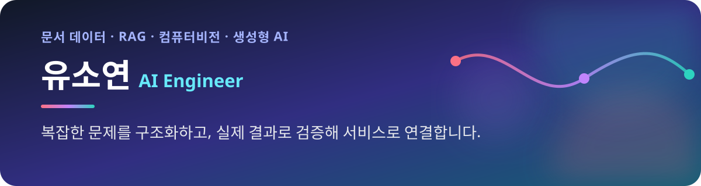
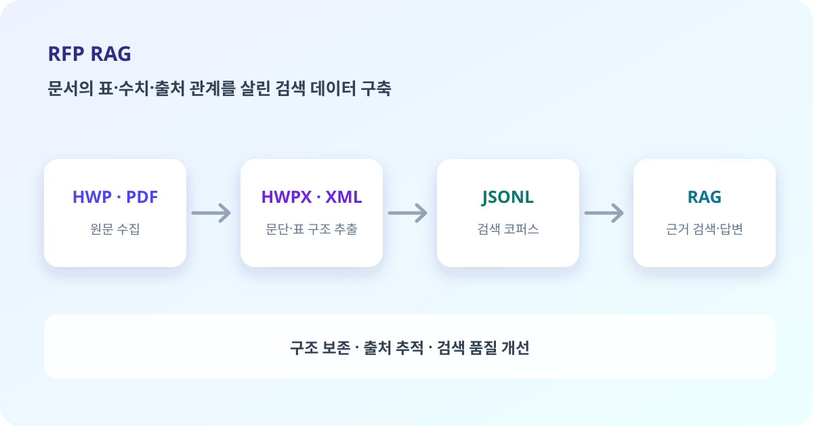
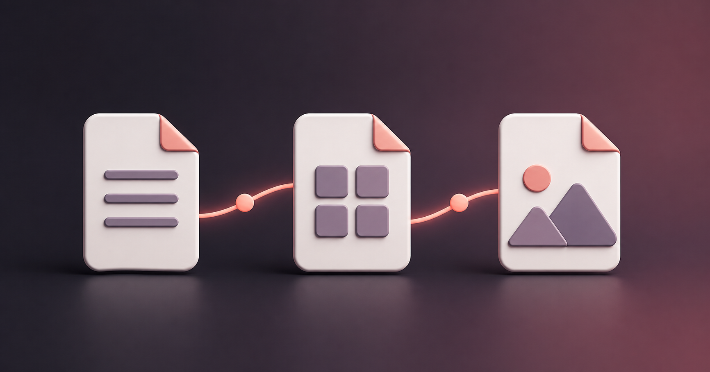
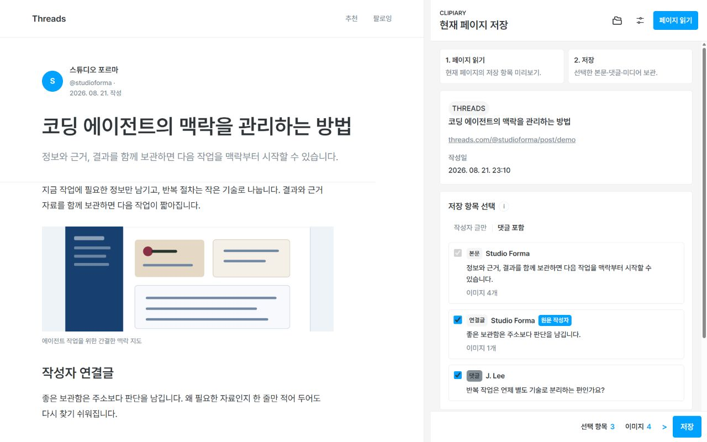
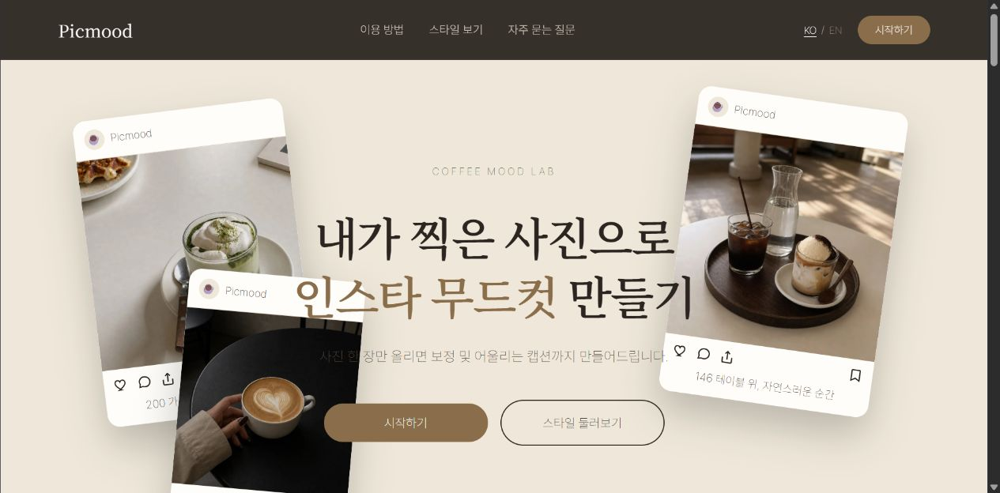

  

  
  
  

## ABOUT ME

### 안녕하세요, YSY Works입니다

문제를 세밀하게 확인하고 기준을 세운 뒤, 다른 사람이 다시 활용할 수 있는 형태로 정리하는 방식으로 일합니다. 서울대학교 대학원에서 실험 조건과 결과를 교차 검증하는 법을 익혔고, 10여 년의 온라인 쇼핑몰 운영을 통해 고객의 모호한 요구와 반복되는 문제를 상품 정보와 업무 기준으로 바꾸어 왔습니다.

지금은 이 습관을 문서 데이터 파이프라인, RAG, 컴퓨터비전과 생성형 AI 서비스 구현에 적용하고 있습니다. 기능이 작동하는 데서 멈추지 않고 실제 데이터와 사용 과정에서 결과를 다시 확인하며, 발견한 문제는 직접 서비스와 도구로 풀어냅니다.

### 일하는 방식

| 구조화 | 검증 |
| --- | --- |
| 복잡한 정보와 모호한 요구에서 문제의 핵심과 판단 기준을 찾고, 데이터 구조와 실행 단위로 구체화합니다. | 정보를 폭넓게 확인한 뒤 필요한 근거를 선별하고, 결과가 기준에 맞는지는 실제 데이터와 사용 과정에서 직접 확인합니다. |

| 실행 | 협업 |
| --- | --- |
| 새로운 모델과 오픈소스의 흐름을 꾸준히 살피고, 필요한 기술은 직접 사용해 본 뒤 서비스와 도구에 적용합니다. | 상대의 말을 충분히 듣고 결정 기준과 진행 상황을 공유해, 팀이 같은 방향으로 판단하고 움직이도록 조율합니다. |

## 대표 프로젝트

<table>
  <tr>
    <td width="50%" valign="top">
      
      <h3>제안요청서 기반 RAG 입찰 지원</h3>
      
표 안의 항목·수치·출처 관계를 살려 기업·정부 RFP를 검색 가능한 데이터로 구축했습니다.

      
<b>담당</b> HWP→HWPX 변환, XML 구조 파싱, JSONL 검색 코퍼스 구축 <b>결과</b> 팀 다중 문서 검색 성능 63.5%→97.92%

      
<a href="https://github.com/hskim2327/chatbot">팀 저장소 보기 →</a>

    </td>
    <td width="50%" valign="top">
      
      <h3>FormatPop</h3>
      
HWP/HWPX의 문단·표·병합 셀 구조 보존을 우선해 편집 가능한 Word로 변환하는 웹 서비스입니다.

      
<b>담당</b> 1인 기획·개발·배포·운영 <b>현재</b> 실제 문서의 구조 손실 사례를 반영하며 개선 중

      
<a href="https://formatpop.com/">서비스 보기 →</a>

    </td>
  </tr>
  <tr>
    <td width="50%" valign="top">
      
      <h3>Clipiary</h3>
      
웹과 SNS에서 필요한 본문·댓글·미디어를 원래 순서와 출처대로 기기에 보관하는 개인 지식 아카이브입니다.

      
<b>담당</b> 1인 기획·개발, 로컬 저장 구조와 검수 기준 설계 <b>현재</b> Chrome Web Store 심사 진행 중

      
<a href="https://ysy-works.github.io/clipiary-site/">제품 안내 보기 →</a>

    </td>
    <td width="50%" valign="top">
      
      <h3>Pickmood</h3>
      
카페 운영자가 제품 사진과 분위기를 선택하면 SNS 이미지·문구·해시태그를 생성하는 서비스입니다.

      
<b>담당</b> PM, 이미지 생성 방식 비교, 프리셋·ComfyUI 공용 흐름 설계 <b>결과</b> 12개 장면 프리셋과 공용 생성 환경 구축

      
<a href="https://github.com/ysy-works/ad-creator">저장소 보기 →</a>

    </td>
  </tr>
</table>

### 경구 의약품 객체 탐지

이미지 속 73종 경구 의약품의 종류와 위치를 식별하는 팀 프로젝트에서 모델링을 담당했습니다. YOLOv8·YOLOv11·YOLO26의 성능과 학습 시간을 비교하고, 소수 클래스 보강과 앙상블을 검증해 Kaggle 공개 리더보드 0.99093을 기록했습니다.  
[팀 저장소 보기 →](https://github.com/wina0901/pill_detection_project)

## 기술과 관심 분야

  
  
  
  
  
  
  
  
  

- **문서·검색:** HWPX/XML 파싱, JSONL, 메타데이터 설계, RAG 검색 데이터
- **모델·생성:** PyTorch, Ultralytics YOLO, OpenAI Images API, ComfyUI
- **서비스 구현:** FastAPI, Docker, React, TypeScript, Chrome Extension, IndexedDB·OPFS

## 지금 하고 있는 일

- 실제 문서에서 발견한 구조 손실을 반영하며 **FormatPop**의 변환 품질 개선
- 웹 자료를 맥락과 함께 다시 활용할 수 있도록 **Clipiary** 개발·배포 준비
- 네이버 정치·경제·세계 뉴스를 모아 검색하고, 조건에 맞는 새 기사를 알려 주는 **Chrome 트레이딩 뉴스 모니터** 개발
- GitHub·Hugging Face·공식 문서에서 새로운 모델과 오픈소스의 흐름을 확인하고 필요한 기술을 프로젝트에 적용
- 부트캠프에서 정리한 AI 학습 기록과 프로젝트 회고를 [블로그](https://blog.naver.com/enteroo_)에 축적

---

문제를 발견하는 데서 멈추지 않고, 실제로 사용할 수 있는 결과까지 이어가겠습니다.

